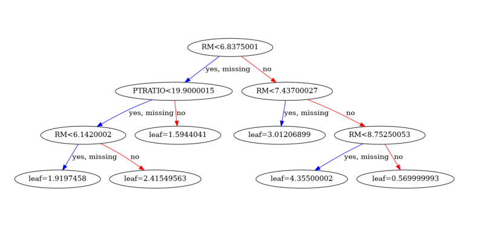
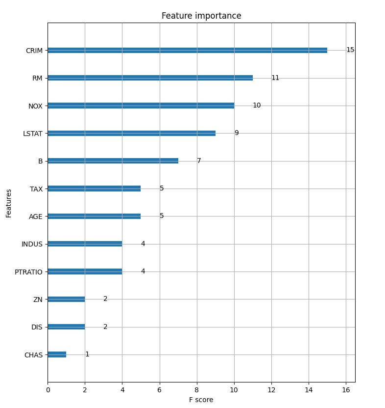

# House price prediciton

using XGBoost

> https://www.datacamp.com/community/tutorials/xgboost-in-python

## Setup

```sh
pip install virtualenv

virtualenv venv

source venv/bin/activate

pip install -r requirements.txt
```

## Plot



To plot trees you must have graphviz

```sh
sudo apt-get install graphviz
```


